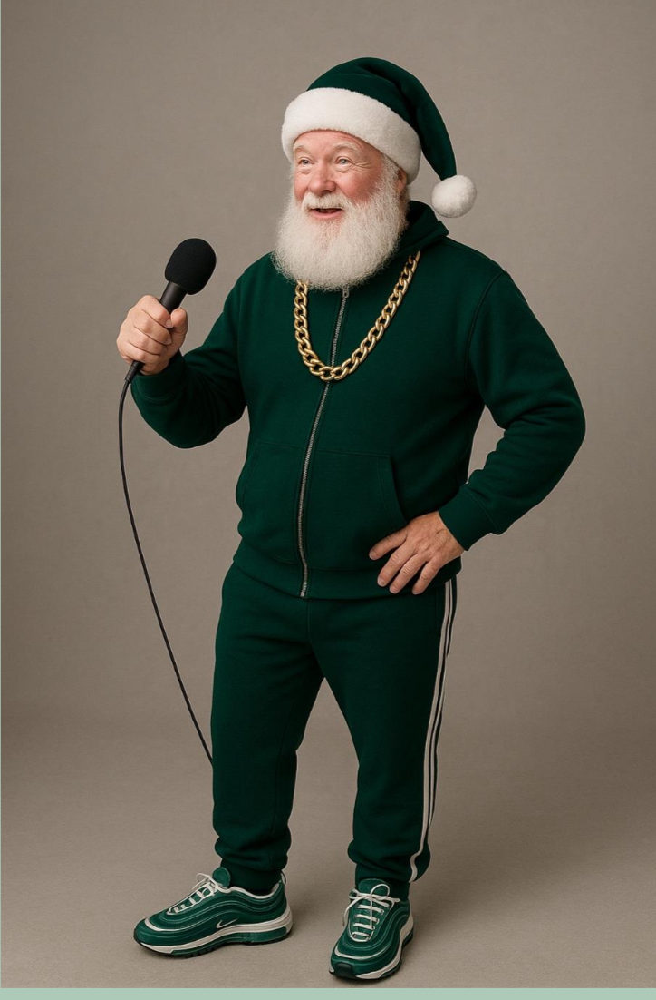
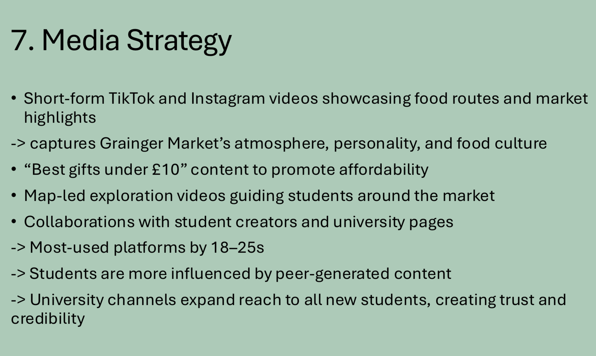

# grainger-market-geordie-santa-campaign
# Wander & Wonder in Winter Wonderland  
**Winning campaign concept for Grainger Market**  
Gardiner Richardson University Challenge

This repository showcases a full-funnel marketing strategy developed for a live brief set by *Gardiner Richardson* for *Grainger Market* — one of Newcastle’s most iconic cultural spaces.

Our team’s proposal was selected as the **winning entry** among all university teams.

---

## Context & Challenge

Grainger Market faced a visibility and relevance gap among students and young adults (18–25).  
Despite being a cultural landmark, it was perceived as “traditional” and disconnected from student life.

The brief challenged us to:
- Reposition Grainger Market for a younger audience  
- Increase footfall during the Christmas period  
- Use **digital-first thinking** aligned with Gen Z behaviour  
- Create a concept that was authentic, scalable, and locally grounded

---

## Strategic Goal

Reintroduce Grainger Market as a *place of discovery, culture, and affordable experiences* for students —  
not just a place to shop, but a place to explore.

**Primary objective:**  
Increase awareness and engagement among students through a social-first, experience-led Christmas campaign.

---

## Target Audience

- Students aged 18–25 in Newcastle (+ Durham & Sunderland)  
- Budget-conscious, experience-driven  
- Heavy users of TikTok & Instagram  
- Influenced by peer-generated content and local culture

---

## Core Idea

**“Wander & Wonder in Winter Wonderland”**

A festive exploration concept that transforms Grainger Market into a space of discovery.

The campaign is built around:
- Interactive food & gift routes  
- “Under £10 gifts” content format  
- Stamp-card rewards and incentives  
- A hero character: **Geordie Santa** — a culturally grounded, humorous guide through the market  

The idea blends:
- Local identity  
- Digital storytelling  
- Behavioural incentives  
- Shareable social formats  

It turns the market into an *experience*, not just a destination.

---

## What I Contributed (My Role)

I led the strategic and executional structure of the campaign, focusing on turning the concept into a deliverable, real-world plan:

- Designed the full campaign flow (phases, timeline, deliverables)
- Developed social-first content formats (Reels, TikToks, carousels)
- Built the engagement mechanics (stamp-card journey & incentives)
- Structured the execution roadmap
- Co-delivered the final agency pitch

My role combined:
- Strategic thinking  
- Product-style planning  
- Audience insight  
- Storytelling for stakeholders  

---

## Key Visuals

---

## Files

- Final presentation: **Grainger Market for Gardiner Richardson.pdf**

---

## Skills Demonstrated

Marketing strategy · digital campaign design · audience research · social media planning · execution frameworks · stakeholder storytelling · teamwork · pitching
